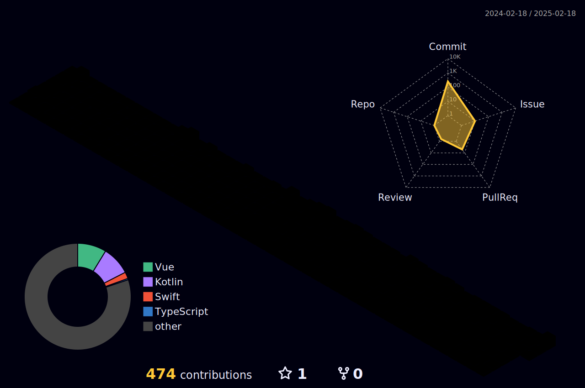

# 👨🏻‍💻 Oneul
### 모바일 개발자(Mobile Developer) - Junior
하고 싶은 건 다 하고 살고 싶은 맥시멀리스트 개발자입니다 😎

- Vue.js 기반 하이브리드 앱
- 안드로이드 네이티브 앱
 

- Swift와 Spring을 공부하고 있습니다.
- 한국어 자연어처리에 관심을 가지고 있습니다.
- 📖 🎸

## 📧 Contact
- toda1213@naver.com

## 📝 Blog

## 🛠️ Tech Stack
### Language
    

### Framework
 

### Tool
   

 

## 🕖 Contributions Overview

